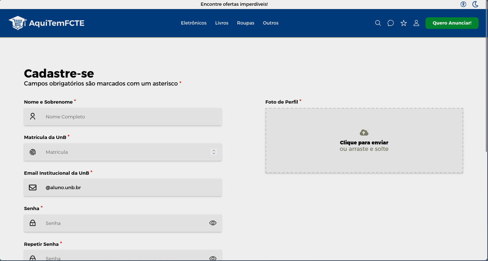

# AquiTemFCTE

**Código da Disciplina**: FGA0208<br>
**Número do Grupo**: 06<br>
**Entrega**: 04<br>

## Alunos
| Matrícula  | Aluno             |
| ---------- | ----------------- |
| 20/2017521 | Algusto Rodrigues |
| 23/1026302 | Caio Lucas        |
| 21/1061583 | Daniel Rodrigues  |
| 23/1011220 | Davi Camilo       |
| 21/1030729 | Eric Rabelo       |
| 23/1011328 | Felipe Campelo    |
| 21/1061897 | Igor Justino      |
| 23/1011515 | Isaque Camargos   |
| 22/2015159 | Lucas Guimarães   |
| 23/1026750 | Ludmila Aysha     |

## Sobre 

O AquiTemFCTE é uma plataforma digital que busca atender às necessidades da comunidade universitária da Universidade de Brasília (UnB) do Campus Faculdade de Ciências e Tecnologias em Engenharia (FCTE). Nosso principal objetivo é facilitar a compra, venda e troca de itens novos e usados exclusivamente entre os estudantes da universidade, criando um ambiente seguro e confiável para transações.

O projeto foi concebido no âmbito da disciplina de Arquitetura e Desenho de Software (UnB - 2025.2) e visa solucionar a dificuldade que muitos alunos têm em encontrar canais confiáveis para negociar produtos dentro do próprio campus. A plataforma centraliza essas atividades e otimiza a experiência do usuário, oferecendo recursos de pesquisa, categorização de produtos e perfis de usuário verificados.

## Screenshots da Quarta Entrega

### 1. Tela de Login Codificado


### 2. Tela de Cadastro Codificado



## Há algo a ser executado?

(x) SIM

( ) NÃO

### Passo 1: Configurar o Backend (API)

#### 1.1. Instalar pipx

```bash
pip install pipx
pipx ensurepath
```

> **Importante:** Feche e abra o terminal novamente para que as mudanças tenham efeito.

#### 1.2. Instalar e configurar o Poetry

```bash
pipx install poetry

# Adicionar plugin do shell
pipx inject poetry poetry-plugin-shell
```

#### 1.3. Configurar Python 3.13 ou 3.12

```bash
# Definir Python 3.13 como versão do projeto
poetry env use python3.13
```

Ou utilize este comando para a versão 3.12:

```bash
# Definir Python 3.13 como versão do projeto
poetry env use python3.12
```

#### 1.4. Instalar dependências Python

```bash
poetry install
```

#### 1.5. Configurar variáveis de ambiente

Crie um arquivo `.env` na raiz do projeto seguindo o padrão do arquivo `.env.example`:

```bash
cp .env.example .env
```

#### 1.6. Subir os serviços do banco de dados

```bash
docker-compose up --build
```
Este comando irá subir:

- **PostgreSQL** na porta `5432`
- **Redis** na porta `6379`

### Passo 2: Executar o Ambiente de Desenvolvimento

Com o backend configurado, agora execute todo o ambiente (frontend + documentação + API):

```bash
npm run dev
```

Este comando irá iniciar simultaneamente:

- **API FastAPI** em `http://localhost:8000`
- **Frontend React** em `http://localhost:5173`
- **Documentação Docsify** em `http://localhost:3000`

### URLs de Acesso

- **Frontend (React)**: `http://localhost:5173`
- **Documentação**: `http://localhost:3000`
- **API**: `http://localhost:8000`
- **Documentação da API (Swagger)**: `http://localhost:8000/docs`

## Informações Complementares 
_Sem informações complementar_

## Histórico de Versões

| Versão | Data       | Descrição                                   | Autor(es)                                         | Revisor(es)                                      | Detalhes da Revisão                |
| ------ | ---------- | ------------------------------------------- | ------------------------------------------------- | ------------------------------------------------ | ---------------------------------- |
| 1.0    | 19/11/2025 | Criação do Documento                        | [Daniel Rodrigues](https://github.com/DanielRogs) | [Ludmila Nunes](https://github.com/ludmilaaysha) | Faltam tópicos essenciais da página principal |
| 2.0    | 20/11/2025 | Criação dos tópicos de screenshots e instruções de configuração de ambiente                     | [Daniel Rodrigues](https://github.com/DanielRogs) | [Davi Camilo](https://github.com/Davicamilo23) | Sem erros identificados na revisão |